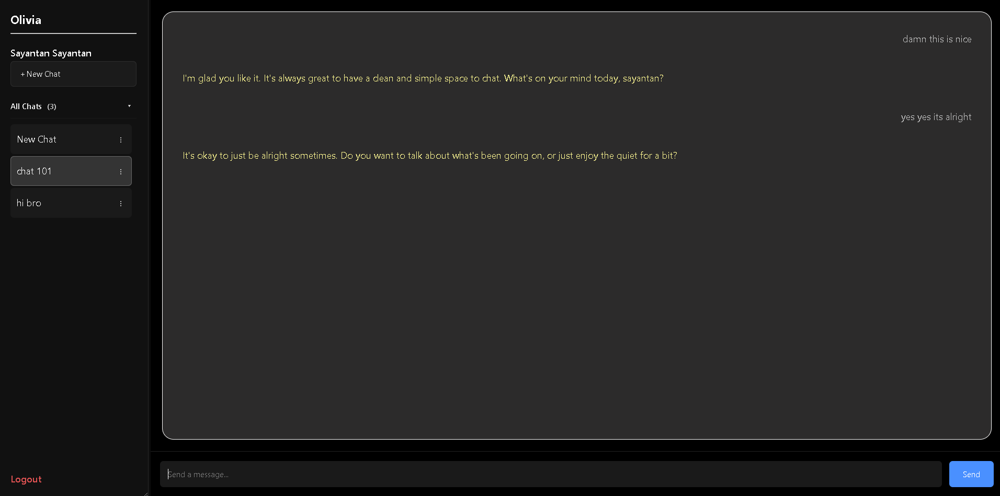

# CohortGPT

CohortGPT is a full stack real time AI chat application built with a React frontend and a Node.js backend. It combines authentication, real time messaging via sockets, and AI powered responses using embeddings and vector search.

The project is structured as a clean frontend backend split, with both sides running independently but communicating over HTTP and WebSocket.

---

## High level overview

Frontend  
- Built with React and Vite  
- Handles authentication UI, chat interface, sidebar, and modals  
- Communicates with backend using Axios and Socket.IO  

Backend  
- Built with Node.js and Express  
- Handles authentication, chat logic, AI services, and sockets  
- Uses MongoDB for persistence and Pinecone for vector search  
- Integrates LLM responses through Groq  

Both frontend and backend are run separately but follow the same dev command pattern.

---



---
## Folder structure

```text
.
├── frontend
│   ├── src
│   │   ├── api
│   │   │   └── axiosClient.js
│   │   ├── components
│   │   │   ├── ChatActionsModal.jsx
│   │   │   ├── ChatArea.jsx
│   │   │   ├── ChatItem.jsx
│   │   │   └── Sidebar.jsx
│   │   ├── pages
│   │   │   ├── Home.jsx
│   │   │   ├── Login.jsx
│   │   │   └── Register.jsx
│   │   ├── styles
│   │   │   ├── globals.css
│   │   │   ├── login.css
│   │   │   ├── register.css
│   │   │   ├── home.css
│   │   │   ├── modal.css
│   │   │   ├── chatarea.css
│   │   │   └── sidebar.css
│   │   ├── socket.js
│   │   ├── App.jsx
│   │   └── main.jsx
│   ├── index.html
│   ├── vite.config.js
│   ├── package.json
│   └── README.md
│
├── backend
│   ├── src
│   │   ├── db
│   │   │   ├── db.js
│   │   │   └── pinecone.js
│   │   ├── models
│   │   │   ├── user.model.js
│   │   │   ├── chat.model.js
│   │   │   └── message.model.js
│   │   ├── routes
│   │   │   ├── auth.routes.js
│   │   │   └── chat.routes.js
│   │   ├── controller
│   │   │   ├── auth.controller.js
│   │   │   └── chat.controller.js
│   │   ├── middlewares
│   │   │   └── auth.middleware.js
│   │   ├── services
│   │   │   ├── embedding.service.js
│   │   │   ├── vector.service.js
│   │   │   └── groq.service.js
│   │   ├── sockets
│   │   │   ├── socket.server.js
│   │   │   └── socket.backup.js
│   │   └── app.js
│   ├── server.js
│   ├── test-embed.js
│   ├── package.json
│   └── .env.example
│
└── README.md
````

---

## Tech stack

Frontend

* React
* Vite
* Axios
* Socket.IO Client
* React Router

Backend

* Node.js
* Express
* MongoDB with Mongoose
* Socket.IO
* JWT authentication
* Pinecone vector database
* Groq LLM integration

---

## Environment variables

Create a `.env` file inside the backend folder.

```env
MONGO_URL=mongodb://localhost:27017/CohortGPT
JWT_SECRET=your_jwt_secret

GROQ_API_KEY=your_groq_api_key
GROQ_MODEL=llama-3.1-8b-instant

PINECONE_API_KEY=your_pinecone_api_key

FRONTEND_URLS=http://localhost:5173
NODE_ENV=production
```

Create a `.env` file inside the frontend folder if needed.

```env
VITE_API_URL=http://localhost:3000
```

---

## Installation

Clone the repository first.

```bash
git clone <repository-url>
cd <repository-name>
```

---

## Running the backend

```bash
cd backend
npm install
npm run dev
```

Backend runs on port 3000 by default.

---

## Running the frontend

Open a new terminal.

```bash
cd frontend
npm install
npm run dev
```

Frontend runs on port 5173 and connects to the backend via `VITE_API_URL`.

---

## How it works

* Users authenticate using JWT based authentication
* Frontend communicates with backend REST APIs using Axios
* Real time chat updates are handled via Socket.IO
* Messages are embedded and stored using vector services
* Relevant context is retrieved using Pinecone
* AI responses are generated using the Groq service
* Chat state updates instantly across connected clients

---

## Scripts reference

Backend

* `npm run dev` runs the backend with nodemon
* `npm start` runs backend in production mode
* `npm run test-embed` tests embedding logic

Frontend

* `npm run dev` starts Vite dev server
* `npm run build` builds production bundle
* `npm run preview` previews production build
* `npm run lint` runs ESLint

---

## Notes

* Both frontend and backend are intentionally decoupled
* Socket logic is isolated under the sockets directory
* AI related logic is isolated under services
* Designed for local development first, production ready later

---

## Possible improvements
- Markdown rendering
- Better styling

---

## Author

Sayantan Bharati

---

This project focuses on real world architecture, clean separation of concerns, and practical AI integration rather than demo level implementations.
